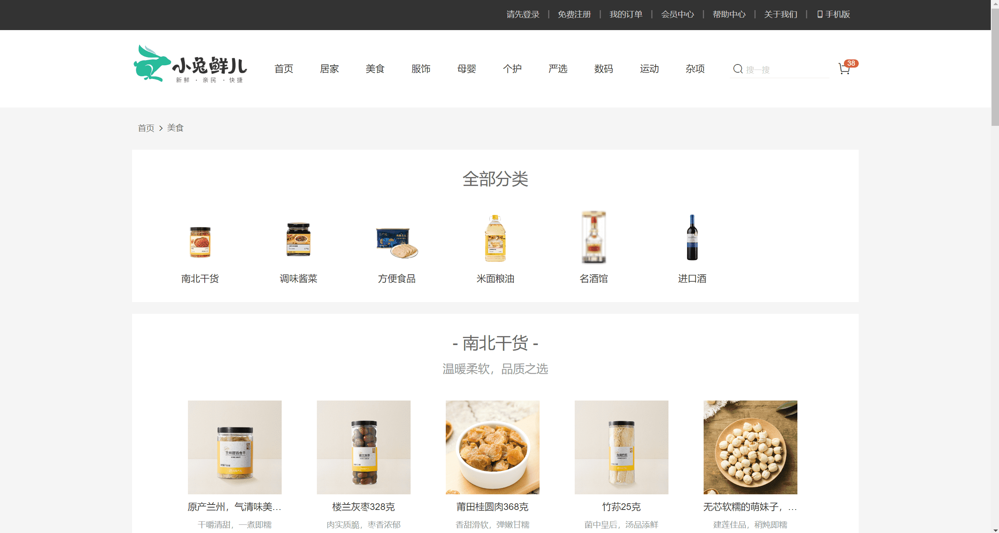
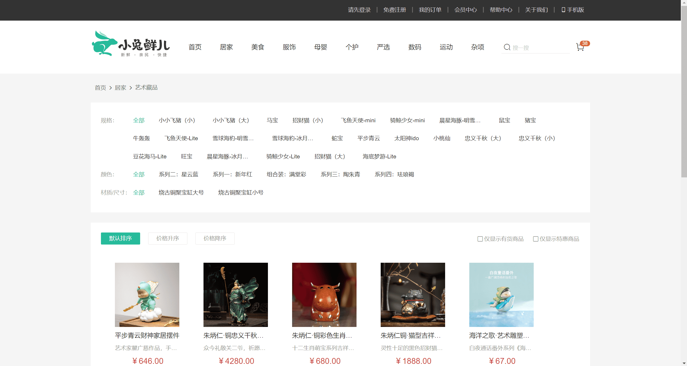
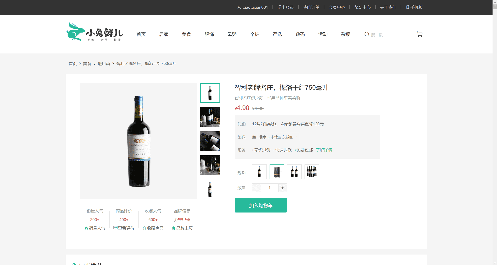
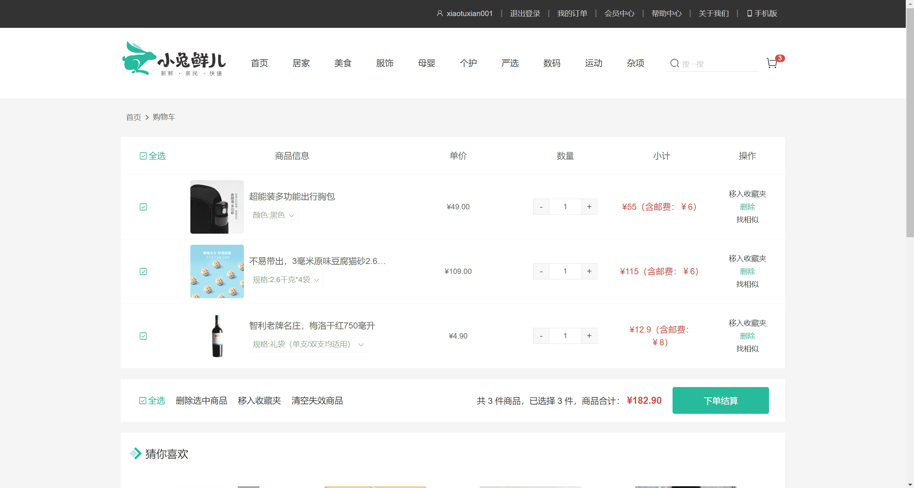
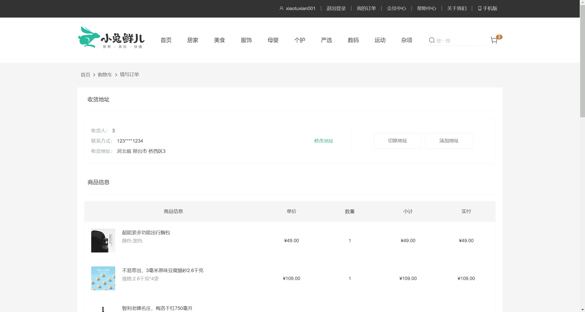
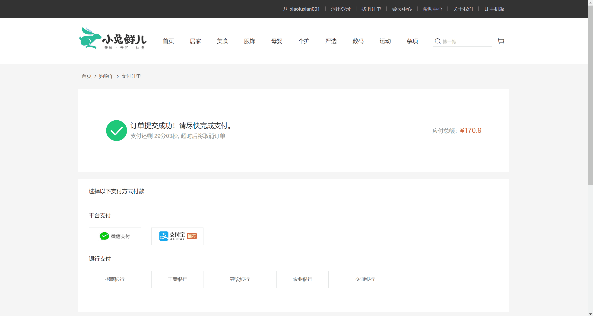
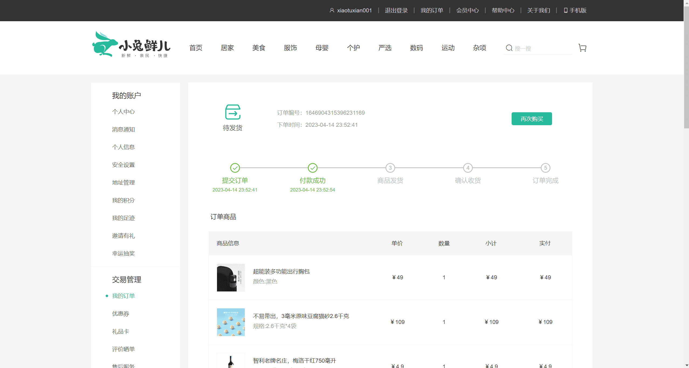
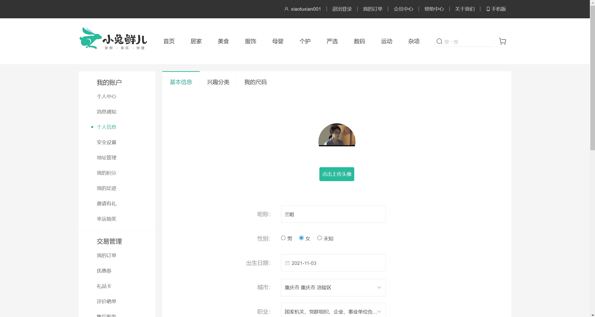
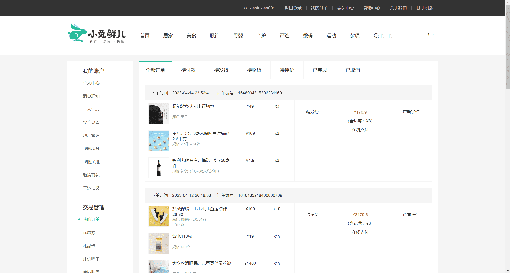

<p align="center">
	<a href="https://github.com/vuejs/vue"></a>
	<a href="https://github.com/axios/axios"></a>
	<a href="https://github.com/lodash/lodash"></a>
	<a href="https://github.com/ElemeFE/element-ui"></a>
	<a href="https://github.com/hilongjw/vue-lazyload"></a>
</p>

## vue-app

项目基于 Vue2 全家桶开发的 单页面电商网站

后端 API文档[点我](http://zhoushugang.gitee.io/erabbit-client-pc-document/api.html)

喜欢的话欢迎 star

### 安装

```
$ git clone https://github.com/xyyfun/xiaotuxian.git
$ cd vue-app
$ npm install
```

### 运行

```
$ npm run serve
```

### 部署

```
$ npm run build
```

### 进度

- [x] 首页
- [x] 登录
- [x] 注册
- [x] 商品所有分类

  - [x] 商品分类

- [x] 商品详情
  - [ ] 商品评论
- [x] 购物车
- [x] 提交订单
- [x] 支付
- [x] 个人中心
  - [x] 个人中心
  - [x] 个人信息
  - [ ] 安全设置
  - [x] 地址管理
  - [x] 我的足迹
  - [x] 我的订单
    - [ ] 商品跟踪 
  - [x] 我的收藏商品
  - [ ] 收藏的专题
  - [ ] 关注的品牌
- [x] 下载手机应用

### 使用技术

- Vue2（选项式 api 开发）
- vue-cli（项目脚手架）
- axios（项目请求工具）
- vue-router（单页面路由）
- vuex（状态管理）
- 算法库[Power Set](https://github.com/zhousg/javascript-algorithms/tree/master/src/algorithms/sets/power-set)
- vue-lazyload（图片懒加载）
- lodash（工具库）
- less（预编译器）
- element-ui（第三方组件库）

### 封装的组件

- 面包屑组件
- 分页组件
- 城市选择组件
- 弹出框组件
- 模块头部组件
- 骨架屏组件
- ‧‧‧‧‧‧

### 函数封装

- 表单验证
- 读取/存储用户数据
- IntersectionObserver 校验元素是否进入可视区域
- request 二次封装 axios

### 效果图












### 项目难点

- 商品详情规格（sku&spu）

1. 使用第三方算法库[Power Set](https://github.com/zhousg/javascript-algorithms/tree/master/src/algorithms/sets/power-set)将获取的数据封装成带有所有商品规格的路径字典。
2. 点击商品规格，发送规格 id，根据 id 在路径字典中进行查找，在字典中可点击，不在字典中则禁用
